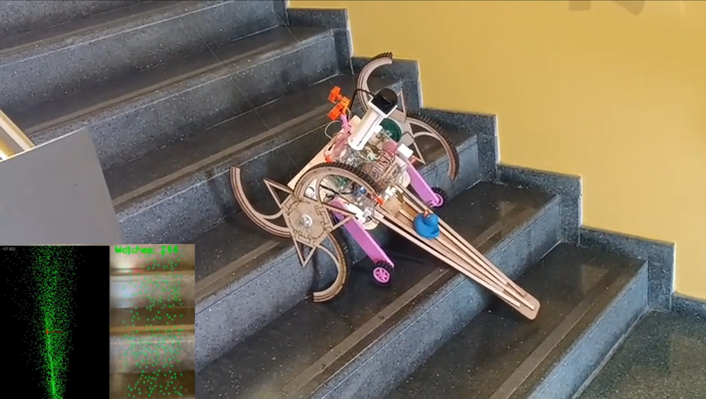
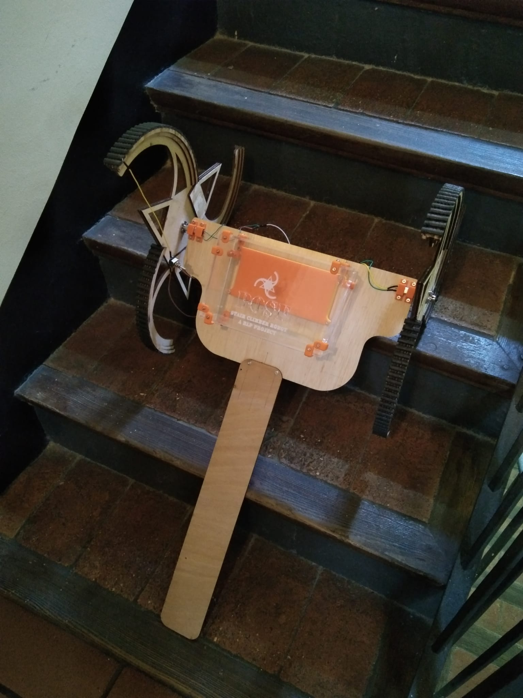
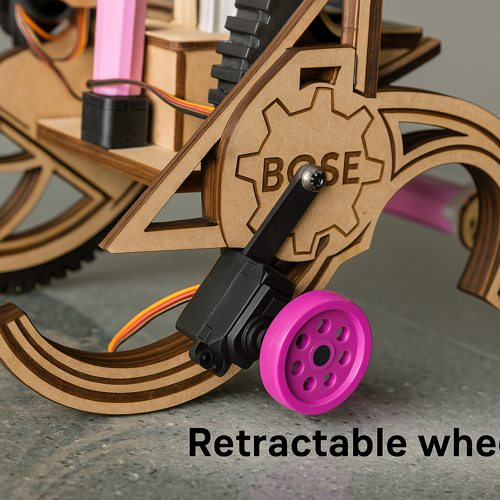
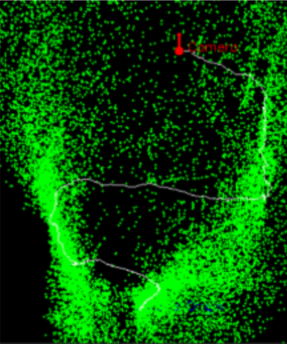
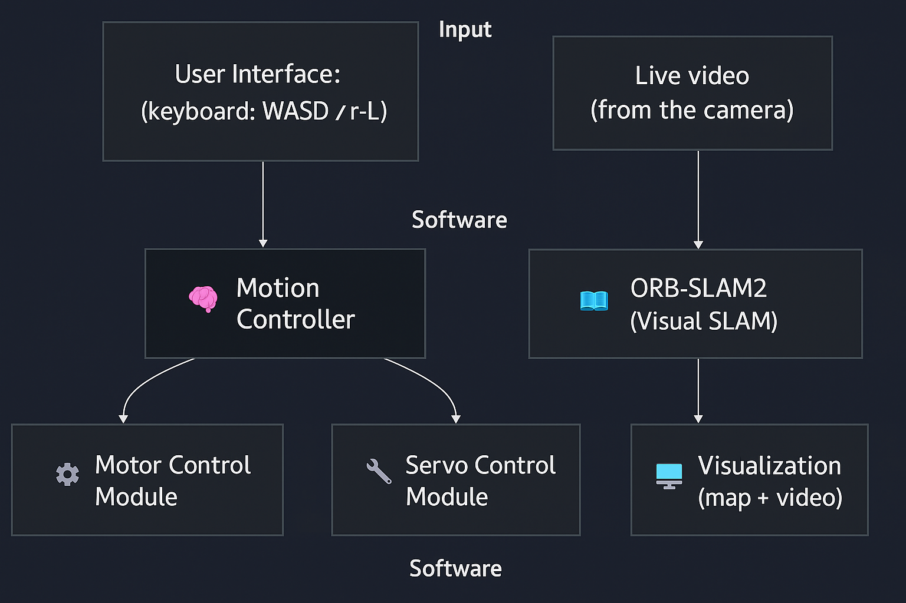
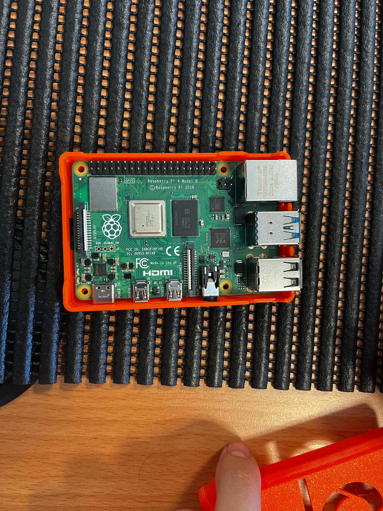
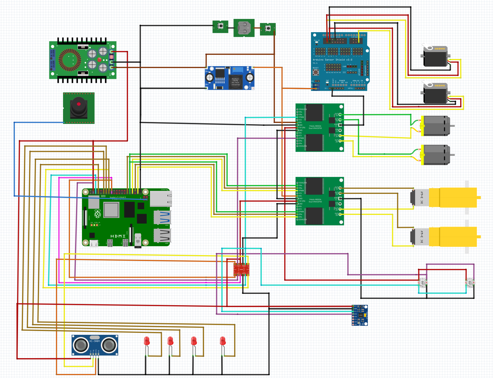
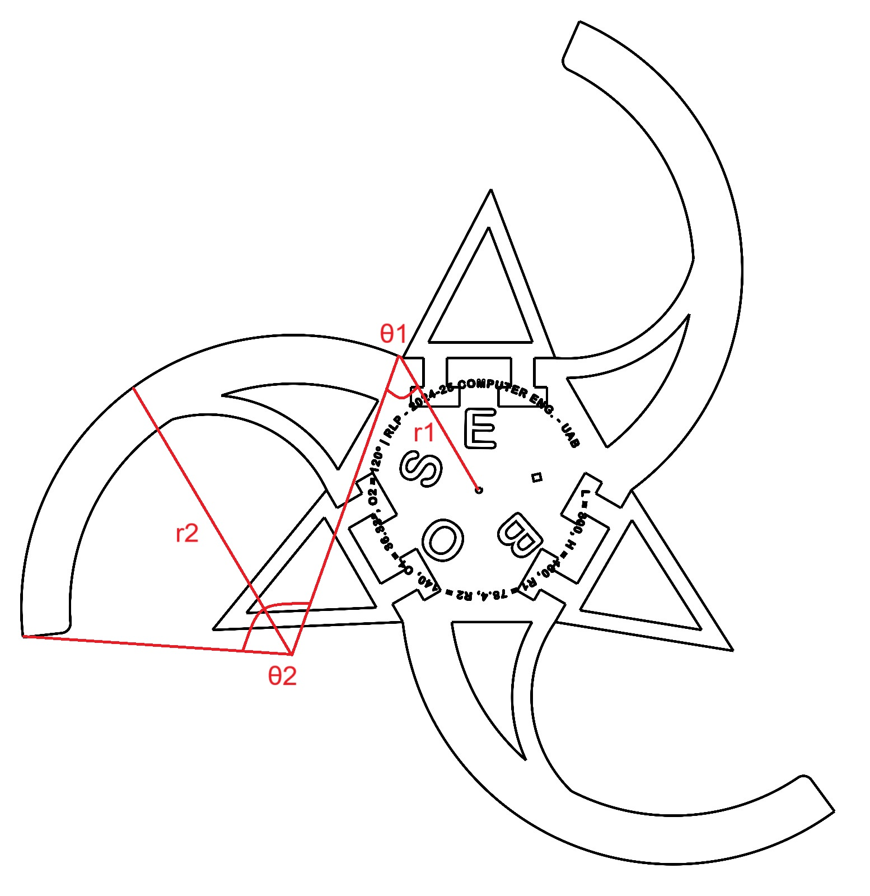

# Bose: A Stair-Climbing Robot for Hybrid Terrain Navigation

**An open-source, low-cost robot designed to autonomously climb stairs and navigate flat indoor environments using adaptive locomotion and onboard perception.**

---



---

## Table of Contents

- [Overview](#overview)
- [System Architecture](#system-architecture)
- [Repository Structure](#repository-structure)
- [Requirements](#requirements)
- [Installation](#installation)
- [Wiring and Setup](#wiring-and-setup)
- [How to Use](#how-to-use)
  - [Manual Control](#manual-control)
  - [SLAM and Navigation](#slam-and-navigation)
- [Mapping and SLAM](#mapping-and-slam)
- [Hardware Components](#hardware-components)
  - [Tri-Helix Wheels](#tri-helix-wheels)
  - [Retractable Wheels](#retractable-wheels)
  - [Support Tail](#support-tail)
- [Reproducibility](#reproducibility)
- [Citation](#citation)
- [Acknowledgments](#acknowledgments)
- [License](#license)

---

## Overview

**Bose** is a hybrid-terrain mobile robot capable of transitioning between stair-climbing and flat-ground modes through a custom tri-helix wheel system and retractable support wheels. Built around a Raspberry Pi 4 and designed for reproducibility and education, Bose combines real-time terrain classification, SLAM, and autonomous control in a lightweight, low-cost platform.

> 🧠 The robot is named after the **Bose-Einstein distribution**, reflecting its multi-modal adaptability and emergent behavior under constrained environments.

---

## Key Features

- Tri-helix wheel mechanism for stair traversal (up to 20 cm rise)
- Retractable micro wheels for efficient flat-ground navigation
- Real-time 2D SLAM with RPLIDAR C1 and monocular vision
- Terrain classification with ultrasonic sensor + camera
- Fully embedded system: runs on Raspberry Pi 4B (no external microcontroller)
- Modular, laser-cut chassis and 3D-printed mounts
- Reproducible architecture with open-source hardware and software

---

## Media & Demos

| Stair Climb | Terrain Switch | Visual SLAM |
|------------|----------------|-------------|
|  |  |  |

> See the full [demo video on YouTube](https://youtu.be/-nvnbL4hpCc)

---

## System Architecture

### Block Diagram



### Hardware Stack



- Raspberry Pi 4B (4 GB RAM)
- MD25 Motor Controller (tri-helix wheels)
- L298N H-Bridge (retractable wheels)
- PCA9685 Servo Controller
- RPLIDAR C1 (USB)
- HC-SR04 Ultrasonic Sensor
- MPU6050 IMU
- Pi Camera v2 (8MP)
- 14.4V Li-ion Battery
- XL4015 and Pololu 5V 3A Buck Converters
- LEDs, push button, and MH Level Shifter

---

## 🛠️ Build Instructions

### Requirements

- Raspberry Pi 4B with Ubuntu 22.04
- ROS 2 Humble
- Python 3.10+
- Hardware: RPLIDAR C1, HC-SR04, MPU6050, PCA9685, MG996R servos, Maxon motors, etc.


Install dependencies:

```bash
sudo apt update && sudo apt install python3-pip
pip install adafruit-circuitpython-pca9685 smbus2 numpy opencv-python rplidar-robotics
```

## Repository Structure

```
├── docs/
│   └── logs/            # Logs of each working day
|   └── Paper.md         #IEEE Paper of the robot
├── hardware/
│   ├── Circuit/         # Fritzing schematics
│   └── DXF/             # 2D Drawings
|   └── STL/             # CAD models, STL files
├── software/
│   ├── raspberry4b-autonomous-lidar/           # Autonomus Code using RPLiDAR C1
│   ├── raspberry4b-remote/              # Manual Control Script
│   └── visual-slam/           # Visual SLAM Python Implementation
├── Media/                 # Photos and videos 
├── README.md
└── decisions.md           # Traceable engineering decisions
```

---

## Wiring and Setup


See `hardware/wiring_diagrams/raspberry_pi_wiring.pdf` for pinout.

> **Tip:** Use a 4700 μF capacitor near the Pi 5V rail to prevent brownouts during motor actuation.

---

## How to Use

### Manual Control (Interactive Script)

Run:

```bash
python3 scripts/interactive_control.py
```

**Controls:**

- Arrow keys: Helix motors  
- W / A / S / D: Retractable wheel motors  
- O / L: Lower / lift support wheels  
- Q: Quit

---

### SLAM and Navigation (ROS 2)

Launch ROS nodes:

```bash
source ~/ros2_ws/install/setup.bash
ros2 launch bose bringup.launch.py
```

**ROS 2 Topics:**

- `/scan` – RPLIDAR laser scan  
- `/odom` – Encoder-based odometry  
- `/imu/data_raw` – IMU orientation  
- `/camera/image_raw` – Pi camera feed

---

## Mapping and SLAM

Bose integrates:

- ORB-based monocular SLAM (via Pi Camera)
- 360º laser scanning (via RPLIDAR C1)
- Terrain detection (ultrasonic + vision)

A 2D occupancy map is built incrementally and used for localization and planning.

---

## Hardware Components

### Tri-Helix Wheels


Laser-cut, three-lobed wheels for continuous stair climbing. Driven by Maxon motors with 785:1 gear reduction.

### Retractable Wheels

Pololu micro motors and MG996R servos enable flat-ground movement when the tri-helix wheels are lifted.

### Support Tail

A fixed rear extension adds stability on stairs without needing extra sensors or actuators.

---


## Reproducibility

To reproduce the robot:

1. Follow hardware instructions (CAD + wiring)
2. Flash Ubuntu 22.04 and install dependencies
3. Run the test scripts (manual or ROS-based)
4. Use `decisions.md` to trace engineering rationale

All firmware-free and open hardware. See `LICENSE`.

---

## Citation

**Arun Sharma**, **Pau Domínguez Ruiz**, **Gerard Souto Eslava**, **Chengjie Peng Lin**,  
*“Bose: A Stair-Climbing Robot for Hybrid Terrain Navigation,”* Universitat Autònoma de Barcelona, 2025.

```bibtex
@misc{bose2025,
  author      = {Sharma, Arun and Domínguez Ruiz, Pau and Souto Eslava, Gerard and Peng Lin, Chengjie},
  title       = {Bose: A Stair-Climbing Robot for Hybrid Terrain Navigation},
  year        = {2025},
  institution = {Universitat Autònoma de Barcelona},
  note        = {Bachelor’s Course in Computer Engineering}
}
```

---

## Acknowledgments

- Prof. Fernando L. Vilariño Freire  
- Prof. Carlos G. Calvo  
- Prof. Vernon S. Albayeros Duarte  
- Open Labs – Escola d’Enginyeria, UAB  
- Maxon Spain and Robot Electronics support teams

---

## License

This repository is licensed under the MIT License. See `LICENSE` for details.

> For academic use, extension, or replication, please contact the authors or contribute via GitHub issues and pull requests.

---

_"To climb stairs is to rise beyond limits. Bose takes that literally."_
